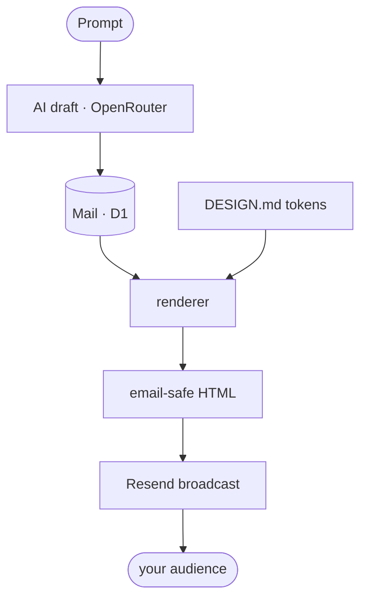

# Open Newsletter — The Open-Source Mailchimp & beehiiv Alternative

[](https://app.clawnify.com/deploy?repo=clawnify/open-newsletter)

A **generation-first newsletter studio**. Describe a newsletter and let AI draft
it, design it live with [DESIGN.md](https://github.com/google-labs-code/design.md)
tokens, and send it to your audience through **Resend**. Built with
**React + Tailwind CSS + Hono + D1**, deploys to Cloudflare Workers via
[Clawnify](https://clawnify.com).

A self-hostable, open-source alternative to **Mailchimp**, **beehiiv**,
**Substack**, and **ConvertKit** — the AI editor, the brand controls, and the
sending pipeline, fully yours. No per-subscriber pricing, no lock-in.


## Features

- **Generation-first editor** — write a prompt, get a structured draft
  (eyebrow, title, deck, Markdown body); revise it in place.
- **Live DESIGN.md design panel** — a Basic/Advanced token editor (colors,
  typography, layout, sections) that re-renders the preview as you type.
  The same tokens drive the sent email.
- **Desktop / Mobile preview** — a faithful canvas that mirrors the email
  renderer exactly.
- **Template library** — three shipped looks (Classic Editorial, Minimal
  Mono, Bold Bulletin); **Save as…** turns any mail into your own template.
- **Resend sending** — send to a Resend audience (broadcast), send a test to
  yourself, or schedule for later. Manage contacts from the Audience view.
- **Email-safe rendering** — table-wrapped, inline-styled HTML with an
  unsubscribe footer (`{{{RESEND_UNSUBSCRIBE_URL}}}`).

## How it works



A **template** = a `DESIGN.md` token set + a content skeleton. Each mail can
override the template's tokens; the design panel edits that override live and
"Save as…" serializes it back to the DESIGN.md format.

## Tech Stack

| Layer | Technology |
|-------|-----------|
| **Frontend** | React, TypeScript, Tailwind CSS v4, Vite, shadcn/ui |
| **Backend** | Hono (Cloudflare Worker) |
| **Database** | D1 (mails, templates, settings) |
| **Email** | Resend (Broadcasts + Contacts API) |
| **AI** | OpenRouter (configurable model) |
| **Icons** | Lucide |

## Quickstart

```bash
git clone https://github.com/clawnify/open-newsletter.git
cd open-newsletter
pnpm install
pnpm dev          # Vite on :5173, Worker + local D1 on :8787
```

Open `http://localhost:5173`. The schema is applied to local D1 automatically.

### Local keys

To exercise sending and generation locally, copy the example env file:

```bash
cp .dev.vars.example .dev.vars
```

```
RESEND_API_KEY=re_xxxxxxxx        # https://resend.com/api-keys
OPENROUTER_API_KEY=sk-or-xxxxxxxx # https://openrouter.ai/keys
# NEWSLETTER_MODEL=anthropic/claude-sonnet-4   (optional override)
```

Restart `pnpm dev` after editing `.dev.vars`.

### Sender setup

In **Settings**, set your publication name and a **from address on a domain
you've verified in Resend**. Audiences are Resend's "segments" — create one in
the [Resend dashboard](https://resend.com/audiences), then it appears in the
Audience view and the send dialog.

## Deploy (Clawnify)

```bash
npx clawnify deploy
```

`clawnify.json` declares the env contract:

| Env | Required | Purpose |
|-----|----------|---------|
| `RESEND_API_KEY` | yes | Send broadcasts + manage contacts |
| `OPENROUTER_API_KEY` | for AI | The Generate button |
| `NEWSLETTER_MODEL` | no | Override the generation model |

On Clawnify these are injected automatically from your org's API keys /
environment variables at deploy time — no secrets in the app.

## Project layout

```
src/
  shared/
    design.ts        — DESIGN.md token model, panel metadata, CSS-var + serializer
    templates.ts     — built-in templates (runtime mirror of templates/*/DESIGN.md)
    markdown.ts      — email-safe Markdown → HTML
    types.ts         — Mail, Template, Settings, Resend types
  server/
    index.ts         — Hono API (mails, templates, settings, audiences, generate, send)
    render.ts        — mail + tokens → email-safe inlined HTML
    ai.ts            — OpenRouter generation
    providers/       — EmailProvider interface + Resend adapter (add providers here)
    schema.sql       — D1 schema
  client/
    app.tsx          — shell + nav
    store.tsx        — app state
    components/
      editor.tsx       — top bar, preview/edit, generation bar
      preview.tsx      — live canvas (mirrors render.ts)
      design-panel.tsx — the DESIGN.md token editor
      …                — mails, templates, audience, settings views
DESIGN.md            — the default brand (Classic Editorial), Google Labs format
templates/<slug>/    — each template as DESIGN.md + content.md
```

## Roadmap

- **HTML-to-image components** — author rich illustrations, diagrams, and
  "component" graphics in HTML + CSS and render them to static images at send
  time, so custom visuals stay email-safe (email clients don't run JS or modern
  CSS). Makes branded illustrations and charts a drop-in block.
- **AI sources** — ground a draft in real data instead of just a prompt. Connect
  a source and the generator pulls from it. First up: **GitHub commits** →
  generate a "what we shipped this week" issue straight from your repo history.
  Planned: changelogs, product analytics, RSS/Atom, Linear/Jira.

## License

MIT
